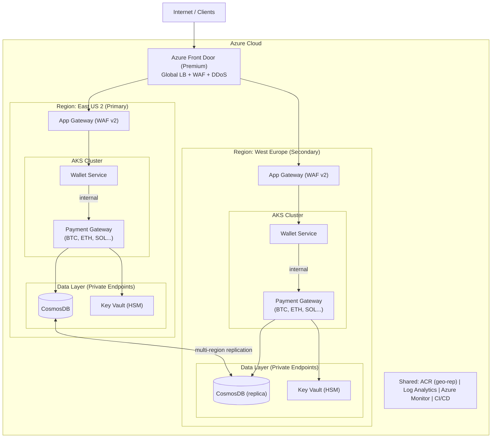

# Part 1 – Architecture & Design

## 1. Azure Services Selection

### Networking

VNet with three subnets: one for AKS, one for data services (CosmosDB, Key Vault), and one for the Application Gateway. Each gets its own NSG rules.

For external traffic, Azure Front Door Premium at the edge — it handles global load balancing, WAF, and geo-routing. Behind that, each region has an App Gateway WAF v2 for SSL termination and routing into the AKS cluster.

All data services connect through Private Endpoints, so CosmosDB, Key Vault, and ACR are never exposed to the internet. For the Payment Gateway specifically, Kubernetes NetworkPolicies restrict ingress to only come from the Wallet namespace.

I'd also add Azure Firewall for egress control to restrict what outbound connections the Payment Gateway can make.

### Compute

AKS with three node pools:
- System pool for K8s components (tainted, no app workloads)
- Wallet pool: Standard_D8s_v5, autoscale 3–20 nodes, across 3 AZs
- Payment Gateway pool: Standard_D4s_v5, isolated for crypto workloads. I want these on separate nodes since they handle private keys

ACR Premium with geo-replication and private endpoint access.

### Secrets

Azure Key Vault Premium — the HSM-backed tier. Crypto private keys need to be non-exportable and FIPS 140-2 Level 2 compliant, so Premium is a must.

Secrets get into pods through the Secrets Store CSI Driver (mounted as volumes, never stored in etcd). Authentication via Workload Identity — each pod gets its own managed identity. The Wallet identity can read secrets but can't sign with crypto keys. Only the Payment Gateway identity has Key Sign permissions.

### Monitoring

Centralized Log Analytics Workspace for everything: AKS logs, CosmosDB diagnostics, Key Vault audit logs. Application Insights for distributed tracing between services. Managed Grafana for dashboards (the team will be more comfortable with it than Azure Workbooks). Alerts go to PagerDuty/Opsgenie through Action Groups.

---

## 2. High-Level Diagram

Traffic flow: Client → Front Door (WAF) → App Gateway (SSL termination) → Wallet (public) → Payment Gateway (internal ClusterIP only) → CosmosDB/Key Vault (via Private Endpoints).

---

## 3. 99.9% Uptime and Multi-Region Failover

Active-active across East US 2 and West Europe. Front Door distributes by proximity and detects region failures via health probes (failover in ~30s).

CosmosDB with multi-region writes, Bounded Staleness consistency (max 5s lag). I chose Bounded Staleness over Strong because Strong kills multi-region writes entirely, and for a financial app we can handle confirmation at the application level. Automatic failover enabled, continuous backup with PITR (30 days).

AKS pods spread across 3 AZs with topology spread constraints. PDBs set to minAvailable: 2. Rolling updates with maxUnavailable: 0.

The composite SLA math: AKS (99.95%) × CosmosDB multi-region (99.999%) × Front Door (99.99%) × Key Vault (99.99%) × App Gateway (99.95%) ≈ 99.88% for a single region. With multi-region active-active we get above the 99.9% target.

---

## 4. Secrets & Keys Rotation

Secrets flow: Key Vault → CSI Driver → volume mount in the pod. Auth via Workload Identity, so there are no credentials to rotate for the auth itself.

For the actual secrets:
- **CosmosDB keys**: rotated every 90 days. Automated with an Azure Automation Runbook triggered by Event Grid on "SecretNearExpiry". Dual-key approach — regenerate secondary, update KV, then regenerate primary. No downtime.
- **TLS certs**: auto-renewal through Key Vault integrated with Let's Encrypt or DigiCert.
- **Crypto private keys**: these don't get "rotated" in the traditional sense since they're HSM-backed and non-exportable. Signing happens inside the HSM. When we do need to rotate (key compromise, compliance), it requires dual-person approval via PIM and an overlap period where both old and new keys are valid.

All key access is logged to Log Analytics for the audit trail.

---

## 5. Provider-Agnostic Solution

The architecture is designed in layers so each one can be swapped independently:

- **Containers**: Docker images run on AKS, EKS, or GKE without changes
- **Orchestration**: Kubernetes manifests and Helm charts are the same everywhere
- **Secrets**: I'd use External Secrets Operator (ESO) instead of coupling directly to Key Vault. It abstracts the backend behind a Kubernetes CRD — switching from Key Vault to AWS Secrets Manager is a config change, not a code change
- **IaC**: Terraform with provider-specific modules (azure/, aws/, gcp/) behind a common variable interface
- **Monitoring**: swap Azure Monitor for Prometheus + Grafana (both CNCF, run on any K8s)
- **CI/CD**: GitHub Actions, not tied to any cloud

The hard part is always the database. CosmosDB → DynamoDB or Spanner requires changes in the data access layer. Having a repository pattern in the app code helps, but honestly a DB migration is never painless.
